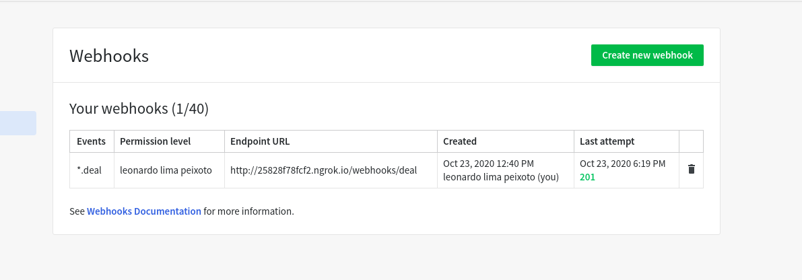

## Descrição
Integração entre Pipedrive e Bling utilizando as tecnologias: NestJS, Typescript, MongoDB e Redis.

### Fluxo
Ao criarmos um deal, o Pipedrive nos encaminha um webhook com o evento que aconteceu e os dados do deal,
ao receber esse evento faço o encaminhamento para uma fila o qual faz a chamada do serviço resposável por
percistir as informações no mongo e criar um deal no Bling caso o status do deal for won.

## Dependências
+ Node v.12
+ MongoDB v4.1
+ Redis v6+
+ Docker v.18+
+ Docker compose v1.24+

## Instalação

```bash
$ npm install
```
## Setup
### Configurando integrações
Antes de qualquer coisa precisamos seguir alguns passos para o funcionamento correto da aplicação.

#### Pipedrive
Devemos configurar o webhook com todos os eventos relacionas ao deal para nosso endpoint, conforme a imagem.



#### Bling
Devemos criar um usuário do tipo api e dar as devidas permissões para que possamos gerar uma api key para se
autenticar na api.

### Configurando o ambiente
A aplicação utiliza variáveis de ambientes para guardar algumas configurações. Podemos definir esse valores
no nosso ambiente ou em um arquivo **.env**. As váriaveis existem estão definidas no arquivo **.env.example**,
basta renomearmos e atribuir os valores conforme a nossa vontade.

### Executando localmente

```bash
# development
$ npm run start

# watch mode
$ npm run start:dev

# production mode
$ npm run start:prod
```

### Executando com docker

```bash
# build and up containers
docker-compose up --build -d
```

## Swagger

para acessar a documentação da api basta acessarmos http://localhost:3000/doc/api


## TODO
- Adicionar testes unitários e de integração
- Se um deal com status de won for reaberto e mudar o status para lost, teremos uma incosistência de informações
- Adicionar paginação GET /orders
